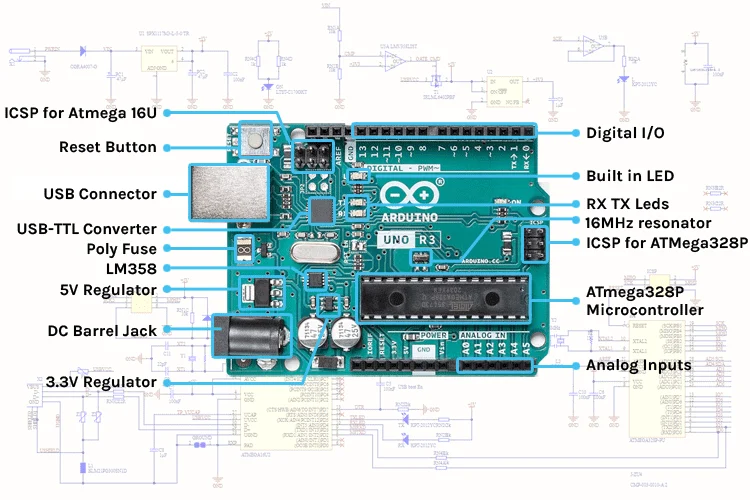
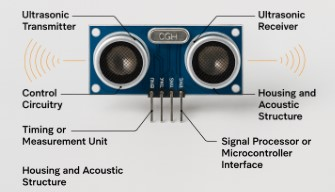

# PROJECT DETAILS
## Introduction
Gesture control is a modern approach to human-computer interaction that allows users to control systems using hand movements without physical contact. This project implements a gesture-based control system using ultrasonic sensors and a microcontroller to detect hand motions in real time.

By measuring the distance between the user’s hand and sensors, the system interprets different gestures and converts them into actions such as scrolling, volume control, and tab switching. This demonstrates a practical application of touchless technology, commonly used in areas like virtual reality, robotics, and smart interfaces.

## Components Used
### Arduino Uno

  

Arduino UNO is a microcontroller board based on the ATmega328P.It has 14 digital input/output pins , 6 analog inputs, a 16 MHz ceramic resonator, a USB connection, a power jack, an ICSP header and a reset button. It contains everything needed to support the microcontroller; simply connect it to a computer with a USB cable or power it with a AC-to-DC adapter or battery to get started. It is programmed based on IDE, which stands for Integrated Development Environment . It can run on both online and offline platforms. And Acts as the main controller to process sensor data

### Ultrasonic Sensors (HC-SR04)

  

An ultrasonic sensor is an electronic device that measures the distance of a target object by emitting ultrasonic sound waves, and converts the reflected sound into an electrical signal. It works on principle similar to sonar or radar which evaluates the attributes of a target by interpreting the echoes from sound or radio waves respectively.And generates high frequency sound waves and evaluate the echo which is received back by the sensor. Used to measure the distance between hand and sensors

### Jumper Wires

For connecting components

### USB Cable

For power supply and data transfer

## Software Requirements
Arduino IDE – To upload code to the microcontroller
Python – For processing sensor data
PyAutoGUI Library – To convert gestures into system actions
